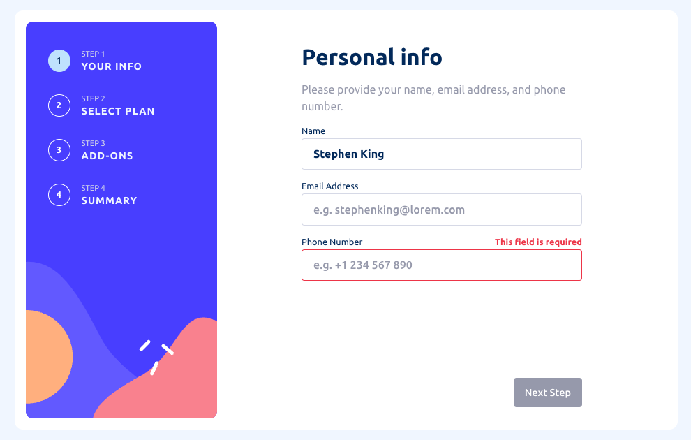

# Frontend Mentor - Multi-step form solution

This is a solution to the [Multi-step form challenge on Frontend Mentor](https://www.frontendmentor.io/challenges/multistep-form-YVAnSdqQBJ). Frontend Mentor challenges help you improve your coding skills by building realistic projects.

## Table of contents

- [Overview](#overview)
  - [The challenge](#the-challenge)
  - [Screenshot](#screenshot)
  - [Links](#links)
- [My process](#my-process)
  - [Built with](#built-with)
  - [What I implemented](#what-i-implemented)

## Overview

### The challenge

Users should be able to:

- [x] Complete each step of the sequence
- [x] See a summary of their selections on the final step and confirm their order
- [x] View the optimal layout for the interface depending on their device's screen size
- [x] See hover and focus states for all interactive elements on the page

### Screenshot

|                            Desktop                            |
| :-----------------------------------------------------------: |
|                                          |
|                          **Mobile**                           |
|  |

### Links

- Solution URL: [Github]()
- Live Site URL: [Vercel]()

## My process

### Built with

- Semantic HTML5 markup
- CSS custom properties
- Scss
- Flexbox
- Mobile-first workflow
- [React](https://reactjs.org/) - JS library
- TypeScript

### What I implemented

1. Use `container-type: inline-size` to enable the new container query feature in CSS. Child components can then use `cqw` and `cqh` as the unit referring to container's width and height. I use this method to dynamically change the `<h1>` font size according to the screen.

2. Write `mask` elements as early as possible so that it will not block pointer event from penetrating.
